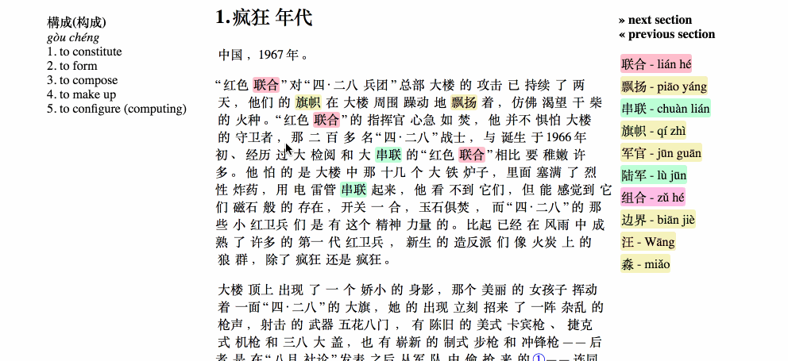

# ben's hacky chinese ebook reader

**disclaimer**: i wrote this while binge watching ozark on netflix, so it's pretty much stream of conciousness. let this be proof that sometimes decent engineers can write miserable code :).

## how to

1. clone this repo
2. acquire chinese epub books and put them in this folder
3. run `python -c "import SimpleHTTPServer; m = SimpleHTTPServer.SimpleHTTPRequestHandler.extensions_map; m[''] = 'text/plain'; m.update(dict([(k, v + ';charset=UTF-8') for k, v in m.items()])); SimpleHTTPServer.test();"`
4. go to `http://localhost:8000/#[epub filename renamed to ascii for best results].epub/0`
5. read some chinese

## controls
- **mouse hover** - show definitions / select word.
- **down arrow / j / l** - go to next word.
- **up arrow / k / h** - go to previous word.
- **enter** - toggle presentation of the word in the glossary.
- **b** - bookmark current word so that when you refresh we jump to this letter.

## credits

- the amazing cc-cedict (cc-cedict.org)
- the amazing zip.js (https://gildas-lormeau.github.io/zip.js/)
 
